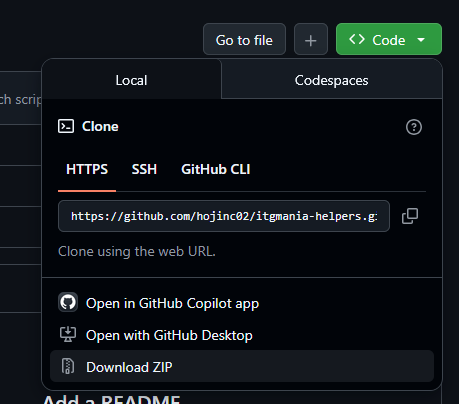
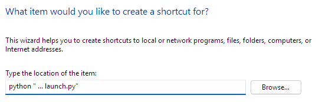
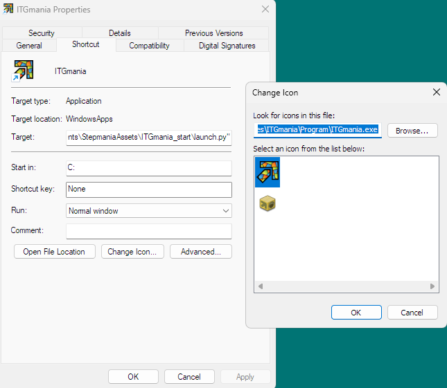
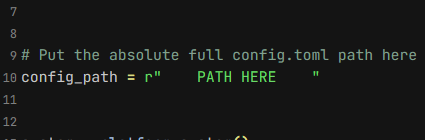

# ITGmania Helpers

## Setup
- Download repo as zip

- Install Python >3.11
    - Check version with `python --version`

### Windows shortcut
You can setup a shortcut on Windows for easy launching of the script. Just write `python <full_path_to_launch.py>`. 

Optionally change the icon as well. 

## Launch

### [`launch.py`](./launch.py)
This is the launch script. Include the config file path in [`launch.py`](./launch.py) before running. 

### [`config.toml`](./config.toml)
All of your configuration information lives [here](./config.toml). Check the comments for specifics. 
- Add files blocks to replace a file with another one, modify settings of a file, or link song folders for specific modes. 
- The mode selected at launch will automatically change which settings and/or song folder is used! 

## Assets
The timing scripts for DDR and ITG mode are in [`Assets/Themes/Simply Love/Scripts`](./Assets/Themes/Simply Love/Scripts). You can put these in your personal `AppData/Roaming/ITGmania` folder if you're on Windows or wherever the real game is installed in. 

## Notes
I have not tested this outside of Windows so if there are issues, feel free to send them through github!